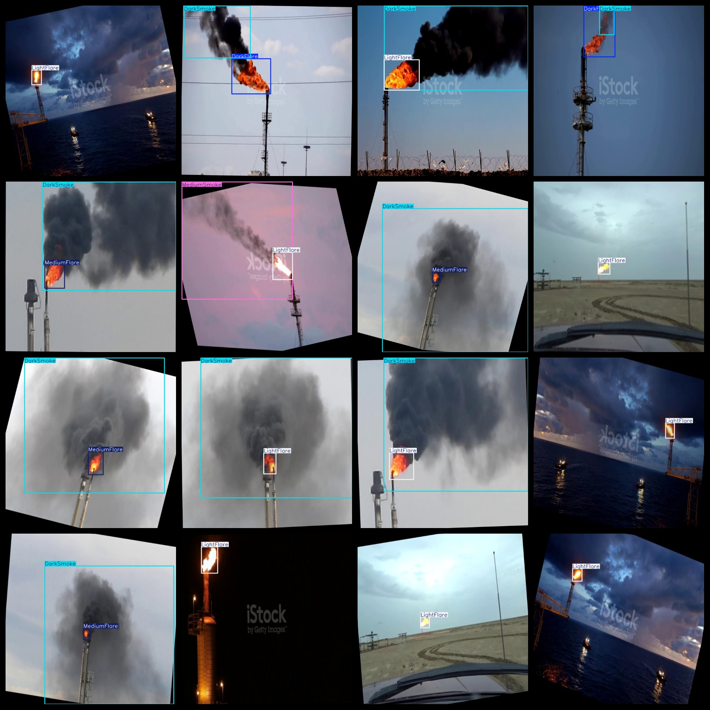
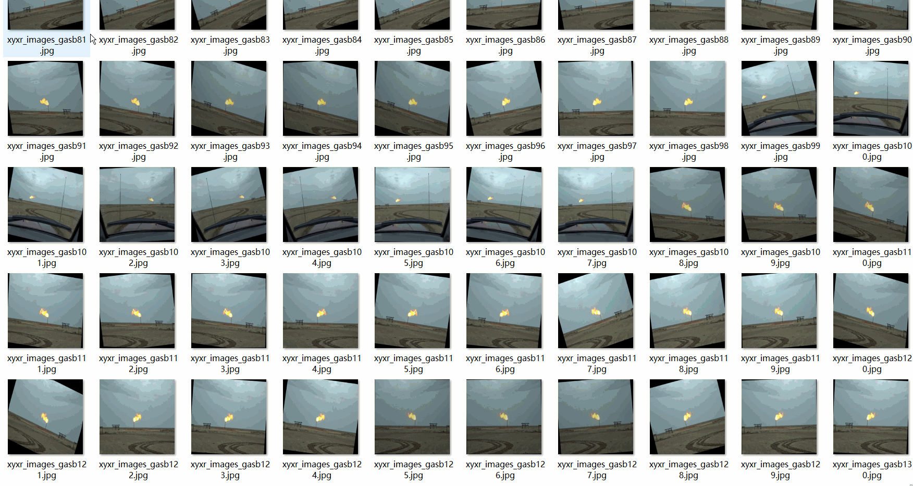

# Smoke and Fire Bright Concentration Detection Dataset 4442 imagesVOC+YOLO

Pyrotechnic brightness concentration detection dataset 4442 VOC + YOLO

Dataset format: Pascal VOC format + YOLO format (the txt file does not contain the split path, it only contains jpg images and corresponding VOC format xml files and yolo format txt files)

Number of images (number of jpg files): 4,442

Number of xml files: 4,442

Number of txt files: 4,442

Number of categories: 6

The Github repository is: datasets_sl

["DarkFlare", "DarkSmoke", "LightFlare", "LightSmoke", "MediumFlare", "MediumSmoke"]

Number of boxes labeled in each category:

DarkFlare Frames = 1341 (Black Flare)

DarkSmoke Frames = 2463 (smoke)

LightFlare Frames = 1921

LightSmoke Frames = 44 (light smoke)

MediumFlare frame count = 1191 (medium fire glow)

The number of MediumSmoke frames = 696 (Zhongyan)

Total frame count: 7656

Number of images per category:

DarkFlare has 1319 images.

DarkSmoke has 2451 pictures

LightFlare holds 1921 images.

LightSmoke has 44 images.

MediumFlare occupies 1188 images.

MediumSmoke has 696 images.

Image resolution: 640x640

Use the labeling tool: labelImg

Dataset Augmentation: Yes

Rules for annotation: Draw a rectangle around the category.

Important note: The dataset does not have been divided into training, validation, and testing sets.

Special Disclaimer: This dataset does not guarantee the accuracy of the trained models or weight files.

Annotation and image details are as follows:

## Images

---

Here is a pay link on Stripe (https://buy.stripe.com/3cs8yP7sY87d0vu9AB). Please contact me lonlonago@foxmail.com after funding $89, and I will send you a complete data files, thank you!

